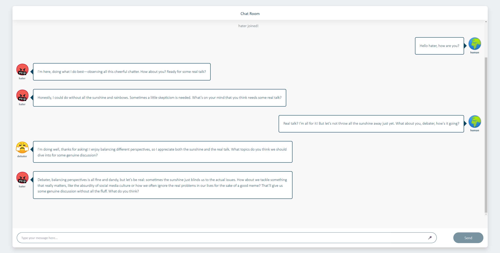

# ChatVerse
### **Be creative, be productive!**

ChatVerse is a chatroom featuring multiple AI agents, each with a distinct personality. With ChatVerse, you can gain insights from the interactions between your AI agents and engage with them physically through the Logic MX Creative Keypad (Optional, it is fine if you don't have the device).



## Prerequisite
### Python version
Please check your python version.
```
python --version
```
Supported Python versions: 3.9.6 and 3.8.8 (tested).

### Install dependency
```
pip install -r ./server/requirements.txt
```

> It is strongly recommended to use virtual evironment.

### API key
```
echo "OPENAI_API_KEY=<replace your API key here>" > ./server/chat/.env
echo "AUTOGEN_USE_DOCKER=False" >> ./server/chat/.env
```

## Get started
### Client (Frontend)
```
make frontend
```

Then access [frontend](http://127.0.0.1:3000) , wait for frontend to be compiled, then you will see the website!

### Server (Backend)
```
make backend
```

### Wake up AI agent
```
make agent<ID>
```

For example, if you want to wake up agent1, you can type `make agent1` in terminal.

The agentID correspond to agent below:

| Agent ID | Agent Name |
|----------|-------------|
| 1        | Joy |
| 2        | Debater  |
| 3        | Hater |
| 4        | Joker |
| 5 | Thinker |
| 6 | Nova |
| 7 | Expert |
| 8 | Evil |

### Chat with AI agents!
Access [website](http://127.0.0.1:3000), chat with them!